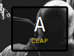

# 1. JavaScript30_challenges_resolution
Dépôt git pour mes solutions au challenge JavaScript30.
# 2. Sommaire
- [1. JavaScript30_challenges_resolution](#1-javascript30_challenges_resolution)
- [2. Sommaire](#2-sommaire)
- [3. 1 Le challenge JavaScript30](#3-1-le-challenge-javascript30)
- [4. 2 Où ai-je trouvé ce challenge ?](#4-2-où-ai-je-trouvé-ce-challenge-)
- [5.  Jour 1](#5--jour-1)
  - [5.1. Description](#51-description)
  - [5.2. Démonstration](#52-démonstration)
- [6. jour 2](#6-jour-2)
  - [6.1. Description](#61-description)
  - [6.2. Démonstration](#62-démonstration)
- [7. jour 3](#7-jour-3)
  - [7.1. Description](#71-description)
  - [7.2. Démonstration](#72-démonstration)
- [8. jour 4](#8-jour-4)
  - [8.1. Description](#81-description)
- [9. jour 5](#9-jour-5)
  - [9.1. Description](#91-description)
  - [9.2. Démonstration](#92-démonstration)
- [10. jour 6](#10-jour-6)
  - [10.1. Description](#101-description)
  - [10.2. Démonstration](#102-démonstration)

# 3. 1 Le challenge JavaScript30
Le challenge javaScript30 est un challenge étalé sur 30 jours. Il permet de renforcer ces compétences en javaScript.
Ce challenge est disponible sur le site [https://javascript30.com/](https://javascript30.com/)

# 4. 2 Où ai-je trouvé ce challenge ?
J'ai trouvé ce challenge sur la chaine youtube de [Geneviève Masioni](https://www.youtube.com/watch?v=Rx8nrnl1bZE) pendant ma veille technologique.

# 5.  Jour 1
## 5.1. Description
Le challenge du jour 1 consiste en la création d'un kit musical. 

La particularité de ce challenge est que les appuis des touches du clavier sont écoutés pour déclencher les animations et les bruitages.

Ci-dessus nous pouvons voir un conteneur représentant notre touche et le bruitage qui vas être produit si la touche **a** est appuyée.
## 5.2. Démonstration

# 6. jour 2
## 6.1. Description
Le challenge du jour 2 consiste en la création d'une horloge. 

La particularité de ce challenge est que le code javaScript vient manipuler le CSS pour effectuer des animations.
Par exemple pour animé l'aiguille des secondes on convertie les secondes en degré : 60 s = 360 deg, puis on vient appliquer le résultat dans la transformation css rotate. 

## 6.2. Démonstration

# 7. jour 3
## 7.1. Description
Le challenge du jour 3 consiste en la manipulation des variables CSS. 
## 7.2. Démonstration

# 8. jour 4
## 8.1. Description
Le challenge du jour 4 consiste en la manipulation des tableaux en js :
* filtrer
* Copier
* Trier des nombres
* Trier des valeurs alphabétique 
* Sommer des colonnes

# 9. jour 5
## 9.1. Description
Le challenge du jour 5 consiste à la mise en place d'une galerie d'image responsive animée quand on clique dessus.

La partie responsive est gérée grâce à la propriété flex de CSS. Le javaScript ne fait qu'appliquer une classe pour animer le conteneur.
## 9.2. Démonstration

# 10. jour 6
## 10.1. Description
## 10.2. Démonstration