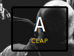
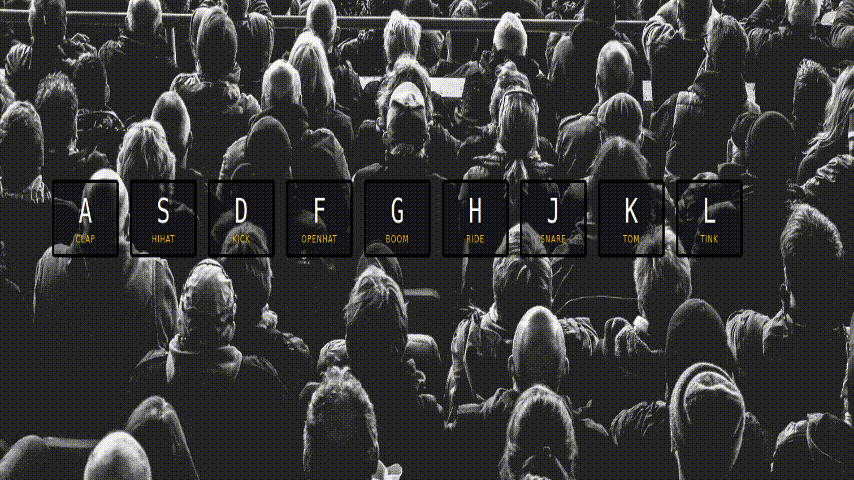

#  Jour 1
## Description
Le challenge du jour 1 consiste en la création d'un kit musical. 

La particularité de ce challenge est que les appuis des touches du clavier sont écoutés pour déclencher les animations et les bruitages.

Ci-dessus nous pouvons voir un conteneur représentant notre touche et le bruitage qui vas être produit si la touche **a** est appuyée.
## Démonstration

