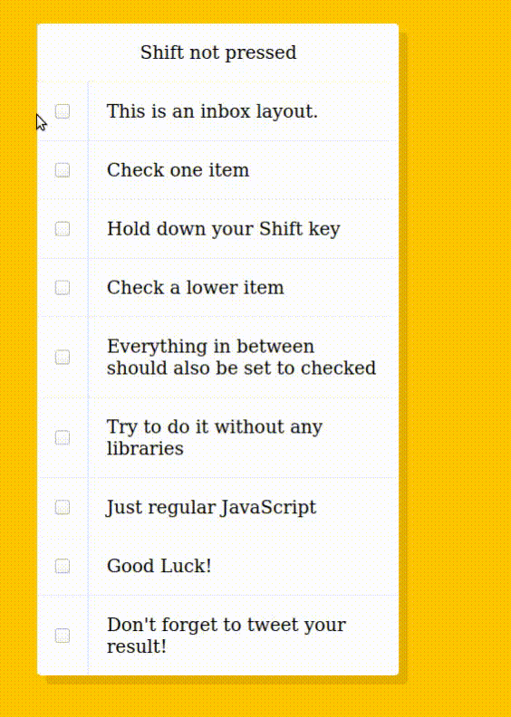

# jour 10
## Description
Le challenge du jour 10 consiste en la manipulation d'une liste de checkbox.

Le but de la manipulation est de cocher/décocher simultanément des checkbox si la touche **shift** est pressée lors du click. 

## Démonstration

