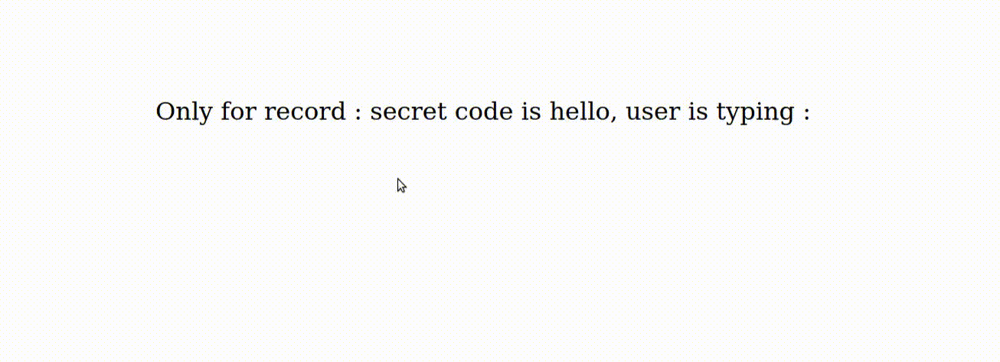

# jour 12
## Description
Le challenge du jour 12 consiste à la mise en place d'un easter egg.

La particularité de ce challenge est le stockage des touches tapées par l'utilisateur pour correspondre à un motif défini.

## Démonstration

