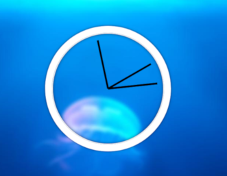
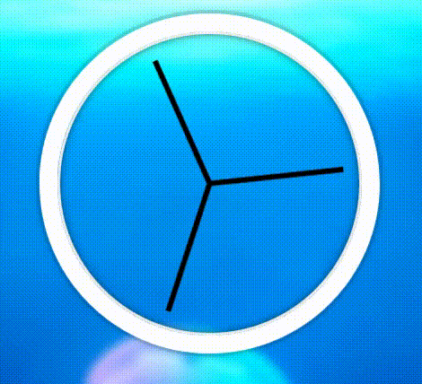
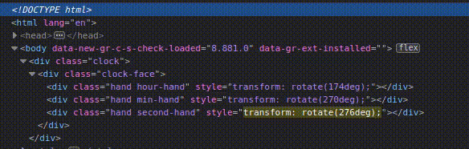

# jour 2
## Description
Le challenge du jour 2 consiste en la création d'une horloge. 

La particularité de ce challenge est que le code javaScript vient manipuler le CSS pour effectuer des animations.
Par exemple pour animé l'aiguille des secondes on convertie les secondes en degré : 60 s = 360 deg, puis on vient appliquer le résultat dans la transformation css rotate. 

## Démonstration

