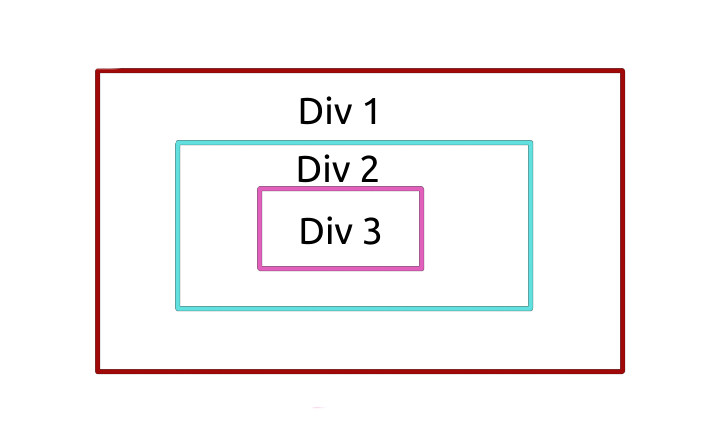

# jour 25
## Description
Le challenge du jour 25 consiste à comprendre la propagation d'un événement sur une page html.

Pour cela, nous avons 3 éléments div imbriqué les uns dans les autres :

Chaque div écoutent l'événement **click**.

### Cas 1
Si on clique sur la div numéro 3 le comportement est le suivant :
l'événement se propage de la div 3 à la div 1.

### Cas 2 
On spécifie l'option capture à true de la fonction **AddEnventListener**, puis on clique sur la div 3 : l'événement se propage de la div 1 à la div 3.

### Cas 3
Dans la fonction de callback on stop la propagation grâce à **event.stopPropagation()**, puis on clique sur la div 3 : seule la div 3 réagie à notre clique. 

### Cas 4
Dans la fonction de callback on stop la propagation grâce à **event.stopPropagation()** et on spécifie **l'option capture à true**, puis on clique sur la div 3 : seule la div 1 réagie à notre clique.

#### Explication du cas 4
1. L'événement se propage de la div 1 à la div 3 grâce à l'option capture à true
2. La propagation est stoppée dès l'appel de la fonction de callback grâce à event.stopPropagation() 
