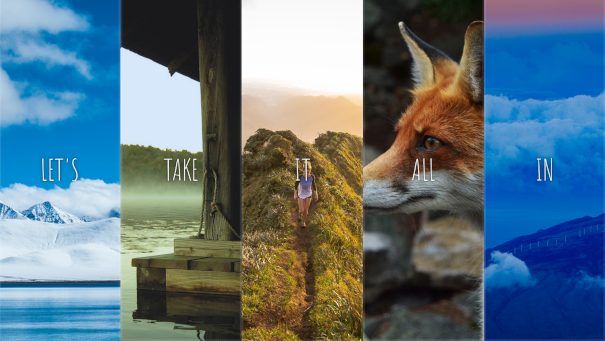

# jour 5
## Description
Le challenge du jour 5 consiste à la mise en place d'une galerie d'image responsive animée quand on clique dessus.

La partie responsive est gérée grâce à la propriété flex de CSS. Le javaScript ne fait qu'appliquer une classe pour animer le conteneur.
## Démonstration

