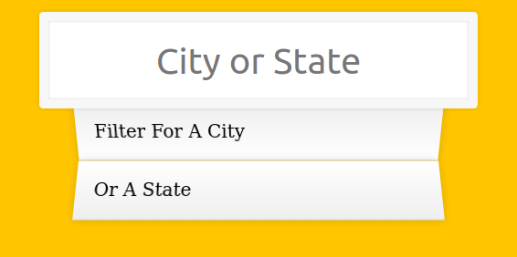
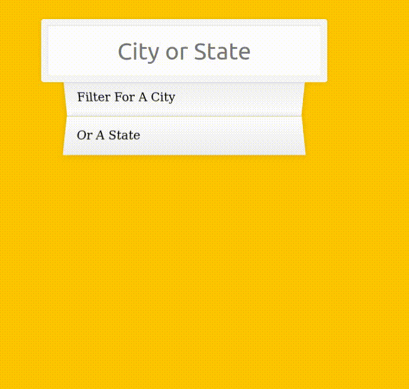

# jour 6
## Description
Le challenge du jour 6 consiste en la création d'un moteur de recherche des villes des États-Unis.

La particularité de ce challenge est que les données se trouvent au format JSON sur Internet.
Pour les récupérer nous allons utiliser la fonction fetch qui vient remplacer l'objet XMLHttpRequest.
Ce challenge permet de manipuler les promesses (traitements de façon asynchrone).

## Démonstration
