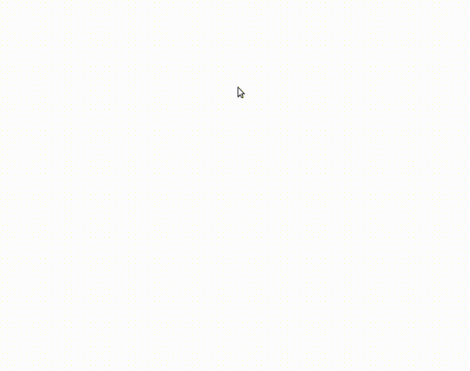

# jour 8
## Description
Le challenge du jour 8 consiste en la création d'une toile de dessin.

Le résultat du jour est volontairement sobre. J'ai prévu plus tard de faire un projet personnel bien plus complet plus tard.

La particularité de ce challenge est l'écoute des événements de la souris :

* Survole de la souris sur notre toile
* Clique principale enclenchée 

## Démonstration

